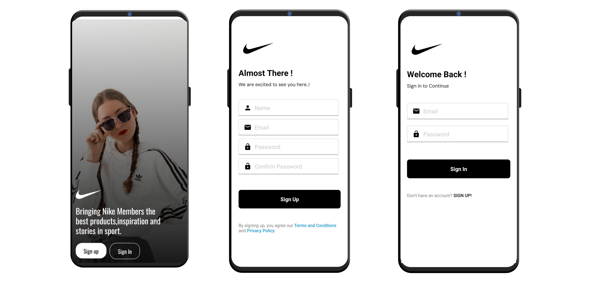
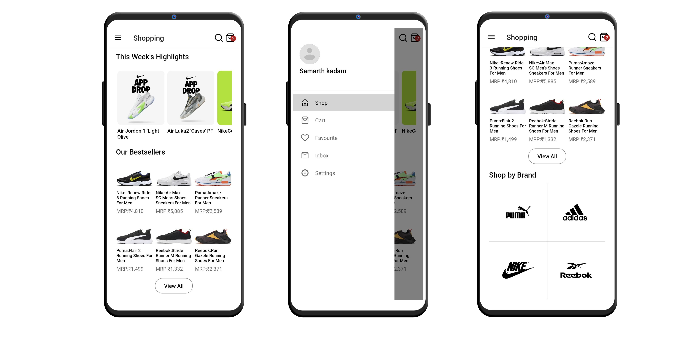
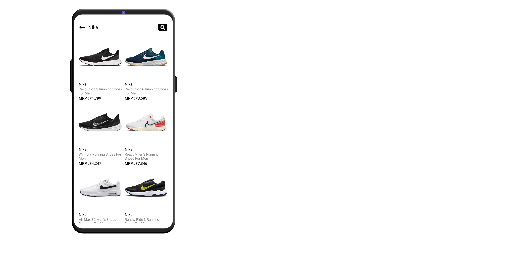
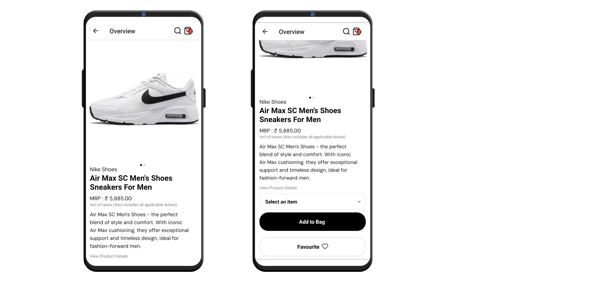
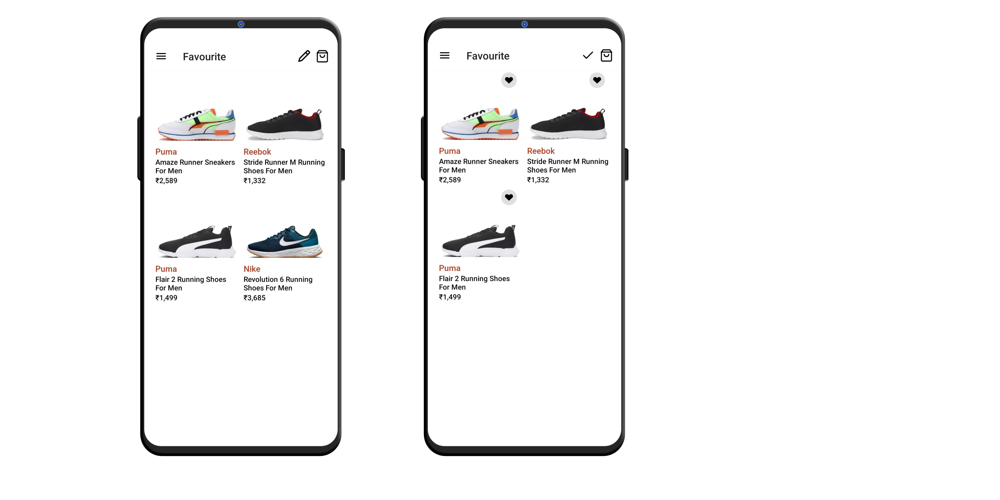
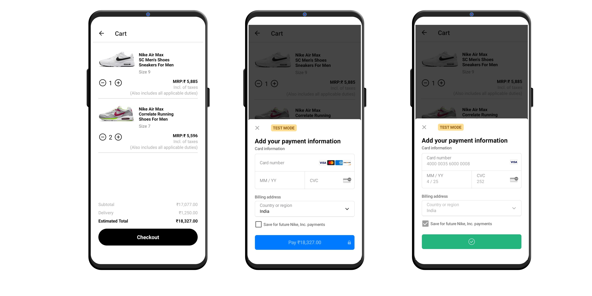
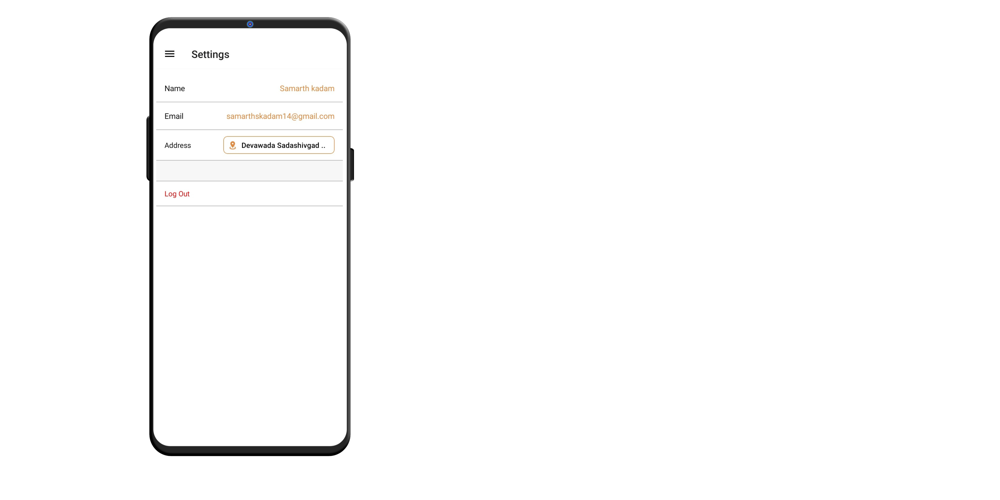

# Nike Mobile App  ☑

Introducing an application that showcases the functionalities of an e-commerce app. Experience all the features you'd find in a typical e-commerce application, allowing you to explore and understand the workings of online shopping. From product browsing to secure transactions, this app provides a comprehensive overview of the essential elements present in an e-commerce experience

  
  

## Features and Interfaces

1. Login/Signup Page
   - Fast and secure authentication
   - Powered by JWT tokens

   -   

2. Home page
   - Showcasing the best-selling shoes
   - Navigate to various screens through Drawer Navigator
   - Shop on the Basis of Brands
   
   -   

3. Search Page
   - Search for products based on name or brand
   - Search over 40+ items

   - 

4. Overview Page
   - Gain an overview of any product, including images, price, and name.
   - You can add the product to your favorites or cart
   - Changes made are persisted in the database

   - 

5. Favourites Page
   - View all your favorite products.
   - You have the option to undo favorites

   - 

6. Cart/Payments Page
   - View all the items in your cart.
   - Increase the quantity of items in your cart.
   - Make payments using a credit card
   - Powered by Stripe

   - 

6. Settings Page
   - View all your information
   - Add your AddressDetails
   - Logout from the App

   - 

## Tech stack

#### Frontend
- ReactNative
- Redux
- Apollo-client
- Stripe

#### Backend
- Graphql
- ExpressJS
- MongoDB
- JWT

#### Other Tools
- NPM packages

## Points to remember while testing the app

1. When testing real devices, make sure your PC and mobile are connected to same network, use network IP address instead of `localhost`
2. In backend directory create a file called .env and add the below files
 MONGO_URI 
 JWTEXPIRES 
 JWTSECRET 
 JWT_COOKIE_EXPIRES

3. Also set up stripe and obtain public key and secret key and also include those in env file 
 SRIPE_SECRET_KEY 
 STRIPE_PUBLIC_KEY

4. Or else you can simple skip the above steps and simply run the mobile app that would make it run on the server instance that is deployed on render

## Instructions

1. Import the project or clone it
   - `https://github.com/SamarthKadam/Nike-MobileApp.git`
2. Install backend and mobile packages using
   - `npm install`
3. Change the URL of backend on mobile if you want to run it on your instance
   -  `BACKEND_URL`
4. Start the backend server using the command
   - `node start`
5. Start the app using the command
   - `npm start && npm run android` 
6. The app is now running

## Download APK:
https://drive.google.com/file/d/1wrZnyiRLVtQ2zMdogJFEDLdXDPKquS48/view?usp=sharing (APK Size: 31 MB)

## Need help?

Feel free to contact me on [Twitter](https://twitter.com/Samarth69908166) or [LinkedIn](https://www.linkedin.com/in/samarth-kadam-119a25209/), know more about me at [samarthkadam.vercel.app](https://samarthkadam.vercel.app/)

